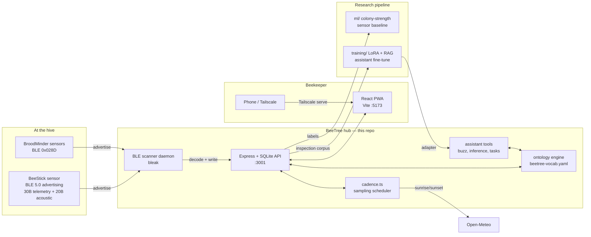

# BeeTree

Beekeeping management and hive sensor monitoring. Yard records, inspections, an
ontology-backed knowledge model, sensor telemetry, and an assistant that answers
questions about your own hives.

Named after the B-tree, because we thought that was funny.

## What's in here

| Path | What it is |
| --- | --- |
| `src/` | React frontend (Vite, Tailwind, React Router) |
| `server/` | Express + SQLite API, ontology engine, assistant tools |
| `server/ontology/` | The beekeeping vocabulary: species, relations, seasonal windows |
| `pi/` | Mentra glasses receiver: a Pi-side HTTP webhook for photo capture |
| `ml/` | Colony-strength research pipeline (sensor baseline, acoustics, LLM) |
| `training/` | LoRA fine-tuning and RAG evaluation for the in-app assistant |
| `e2e/` | Playwright end-to-end tests |
| `grafana/` | Sensor dashboards and provisioning |

The custom BLE sensor hardware (firmware, enclosure, BOM) is not part of this
repository.

## Architecture



## Quick start

```bash
npm install
npm --prefix server install

# Server config (see .env.example)
cp .env.example server/.env

npm run dev            # frontend (Vite)
npm --prefix server run dev   # API
```

The API listens on `:3001` by default and the frontend on `:5173`. On first run
the app shows a setup wizard; a fresh database starts empty by design.

The API generates a random bearer token on boot if `BEETREE_API_KEY` is unset and
prints it to the console. Set it explicitly for anything beyond local dev —
`GET /api/key` will hand it back to a localhost caller, which is convenient for
device pairing and is not a security boundary you should rely on.

## Configuration

Copy `.env.example` to `server/.env`. Everything is optional; see the file for
what each variable does. Nothing in the repo ships a working credential.

## Tests

```bash
npm test               # unit (Vitest)
npm run typecheck
npm run lint
npm run test:e2e       # Playwright
```

Tests that touch the database use an in-memory SQLite instance, so no fixture
data is required.

## Status

Early. The data model, ontology engine, and inspection workflow are in daily use
by one beekeeper. Research code under `ml/` and `training/` is exploratory —
results reported there are not validated across apiaries.

## Credits and data

- UrBAN hive audio and inspection annotations — CC BY 4.0. See `ml/README.md`.
- Beekeeping vocabulary in `server/ontology/beetree-vocab.yaml` draws on published
  extension guidance and standard apiculture terminology.

## License

MIT — see `LICENSE`. Third-party data and dependencies keep their own terms;
notably the UrBAN dataset is CC BY 4.0 and requires attribution.
