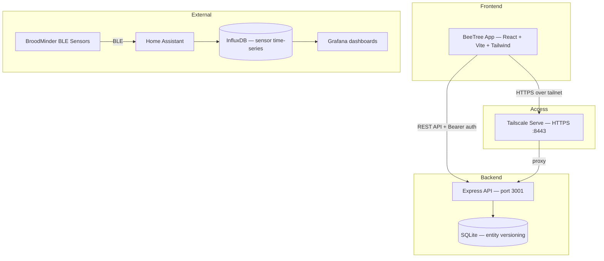

# 🌳 BeeTree

**Beekeeping management & sensor monitoring.** Like a B-tree, but for bees.

A mobile-first React web app for tracking apiaries, hives, inspections, and BroodMinder sensor data. Named after the traditional "bee tree" — a hollow tree where wild bees establish a colony — and the B-tree data structure, because every good beekeeper knows their data structures.

## Features

- **Apiary & Hive Management** — Track multiple apiaries with hive types including Langstroth (10/8-frame), Horizontal Long Hive (25 deep frames), 5-frame Nuc, 7-frame Apimaye, and Apimaye Queen Castle
- **Visual Hive Editor** — Stacked box/frame layout with tap-to-cycle frame content (honey, brood, pollen, feeder, queen excluder, foundation)
- **BroodMinder Sensor Integration** — Assign BLE sensors to hives/boxes with position labels; view temperature, humidity, battery voltage, and signal strength
- **Inspection Records** — Full inspection forms with brood status, queen health, temperament, stores, population, weight, concerns, and notes
- **Task Management** — Apiary/hive-linked tasks with due dates and priorities
- **Dashboard** — Overview of apiary health, sensor readings, recent inspections, and tasks due
- **PWA** — Installable on iOS/Android home screen

## Tech Stack

- **Frontend:** Vite 8 + React 19 + TypeScript 6 + Tailwind CSS v3
- **Charts:** Recharts
- **Icons:** Lucide React
- **Routing:** React Router v7
- **Backend:** Express + SQLite (better-sqlite3) with copy-on-write versioning
- **Migrations:** Versioned SQL files in `server/migrations/`
- **Testing:** Vitest (10 tests, 3 suites)
- **Pre-commit:** pre-commit CLI (typecheck + lint + tests)
- **Linting:** oxlint
- **Serving:** Tailscale Serve (HTTPS over tailnet)
- **Auto-start:** launchd (macOS)
- **Sensor Data:** BroodMinder BLE → Home Assistant → InfluxDB

## Getting Started

```bash
npm install
npm run dev      # Development server at http://localhost:5173
npm run build    # Production build to dist/
npm run preview # Preview production build at http://localhost:4173
```

## Architecture



## License

Private — Shields Farm